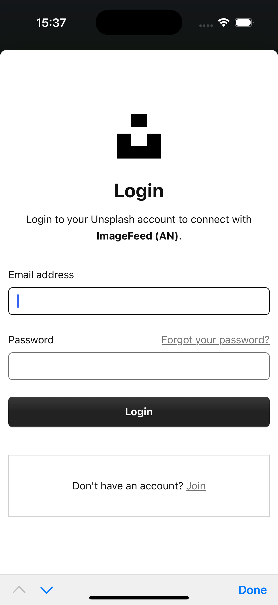

# 🖼 ImageFeed
ImageFeed is an iOS application that displays an infinite feed of photos from the Unsplash API.
The app requires user authorization via OAuth2 and allows users to browse, like, zoom, copy, and share photos. Likes are synchronized with the server.

## ✨ Features
- 🔐 User authentication via OAuth2
- 🌍 Infinite scrolling photo feed (Unsplash API)
- 🔎 Detailed photo view with zoom support
- ❤️ Like / unlike photos with server synchronization
- 📤 Share or copy photos
- 🧪 Unit and UI tests included

## 🛠 Tech Stack
**Language:** Swift 
**UI:** UIKit + Storyboard 
**Architecture:** MVP 
**Networking:** URLSession, REST API, JSON 
**Authentication:** OAuth2 
**Testing:** Unit Tests, UI Tests 
**Design:** Figma 

## 📱 Screenshots

  
  

  
  

## 🎨 Design
The UI/UX design was created in Figma:
👉 [Open Figma Prototype](https://www.figma.com/design/MujlanK7BDoQRrGci5G6pi/Image-Feed--YP-?node-id=318-1469&t=MgHmgrkeG5ZVh4dZ-1)

## 🚀 Installation
1. Clone the repository
2. Open the project in Xcode
3. Run the project on a simulator or device (iOS 13+) **with VPN enabled**

## 📫 Contact
E-mail: alnepryakhin@gmail.com 
Telegram: https://t.me/nizyashka 
GitHub: https://github.com/nizyashka 
